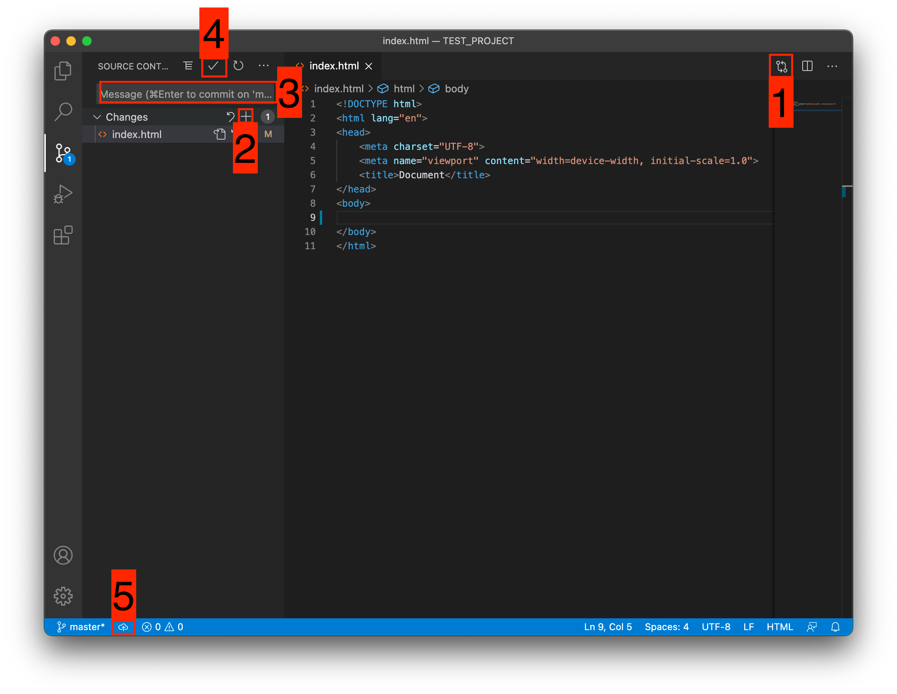

# Инструкция для работы с Git и удаленными репозиториями

## Что такое Git и зачем он нужен?

Git - это консольная утилита, для отслеживания и ведения истории изменения файлов, в вашем проекте. Чаще всего его используют для кода, но можно и для других файлов. Например, для картинок - полезно для дизайнеров.

С помощью Git-a вы можете откатить свой проект до более старой версии, сравнивать, анализировать или сливать свои изменения в репозиторий.

## Установка Git

* Windows. Проходим по [этой ссылке](https://git-scm.com/download/win "Download for Windows"), выбираем под вашу ОС (32 или 64 битную), скачиваем и устанавливаем.

* Для Mac OS. Открываем терминал и пишем:

Если установлен Homebrew

>brew install git

Если нет, то вводим эту команду. 

> git --version

После этого появится окно, где предложит установить Command Line Tools (CLT).

Соглашаемся и ждем установки. Вместе с CLT установиться и git

* Linux. Открываем терминал и вводим следующую команду.

 Debian или Ubuntu

> sudo apt install git

 CentOS

> sudo yum install git

## Настройка

Вы установили себе Git и можете им пользоваться. Давайте теперь его настроим, чтобы когда вы создавали *commit*, указывался автор, кто его создал.

Открываем терминал (Linux и MacOS) или консоль (Windows) и вводим следующие команды.

 1. <u> Установим имя для вашего пользователя </u>

- Вместо *<ваше_имя>* можно ввести, например, *Grisha_Popov*
- Кавычки оставляем
> git config --global user.name "<ваше_имя>"

2. <u> Теперь установим email. Принцип тот же. </u>

> git config --global user.email "<адрес_почты@email.com>"

## Создание репозитория

Создадим наш первый репозиторий. Для этого пройдите в папку вашего проекта.

+ Для Linux и MacOS путь может выглядеть так 
> */Users/UserName/Desktop/MyProject*

+ Для Windows например *С://MyProject*

> cd <*путь_к_вашему_проекту*>

+ Инициализация/создание репозитория
> git init

Теперь Git отслеживает изменения файлов вашего проекта. Но, так как вы только создали репозиторий, в нем нет вашего кода. Для этого необходимо создать commit.

1. Добавим все файлы проекта в нам будующий commit
> git add .

Или так

> git add --all

Или еще такой вариант 
> git add *

Если хотим добавить конкретный файл то можно так

> git add _<имя_файла>_

2. Теперь создаем _commit_. Обязательно указываем комментарий.И не забываем про кавычки

> git commit -m "<комментарий>"

## Создаем свой первый проект и выкладываем на GitHub

Давайте разберемся как это сделать, с помощью среды разработки _Visual Studio Code (VS Code)_.

Перед началом предлагаю зарегистрироваться на [GitHub](https://github.com/).

<image src="https://ru.wizcase.com/wp-content/uploads/2022/03/GitHub-Logo.png" alt="Описание картинки">

 - Создайте папку, где будет храниться ваш проект. Если такая папка уже есть, то создавать новую не надо.

 - После открываем VS Code .

<image src="https://habrastorage.org/getpro/habr/upload_files/415/4fe/297/4154fe297d8f2d82b7d7c4f44b986e00" alt="описание картинки"> 

 > 1. Установите себе дополнительно анализаторы кода для JavaScript и PHP
 > 2. Откройте вашу папку, которую создали ранее

 После этого у вас появится вот такой интерфейс

<image src="https://habrastorage.org/getpro/habr/upload_files/536/76a/b32/53676ab32ff10608c9a4748af3740cbd" alt="описание картинки">

> 1. Здесь будут располагаться все файлы вашего проекта
> 2. Здесь можно работать с Git-ом
> 3. Кнопка для создания нового файла
> 4. Кнопка для создания новой папки

 Давайте теперь перейдем во вкладу для работы с Git-ом.

<image src="https://habrastorage.org/getpro/habr/upload_files/dcf/64a/da5/dcf64ada515fad57d956537797626035" alt="описание картинки">

Откроется вот такое окно:

>1. Кнопка для публикации нашего проекта на GitHub
>2. После нажатия на кнопку 1 , появится всплывающее окно. Нужно выбрать второй вариант или там где присутствует фраза _...public repository_

 _Если вы хотите создать локальный репозиторий и опубликовать код в другой сервис, то необходимо нажать на кнопку **Initialize Repository** . После этого, вручную выбрать сервис куда публиковать._

 ✅ Вы создали и опубликовали репозиторий на GitHub.
 

Теперь сделаем изменения в коде и попробуем их снова опубликовать. Перейдите во вкладку с файлами, отредактируйте какой-нибудь файл, не забудьте нажать crtl+s (Windows) или cmd+s (MacOS), чтобы сохранить файл. Вернитесь обратно во вкладу управления Git.

Если посмотреть на значок вкладки Git, то можно увидеть цифру 1 в синем кружке. Она означает, сколько файлов у нас изменено и незакоммичено. Давайте его закоммитим и опубликуем:

1. Кнопка для просмотра изменений в файле. Необязательно нажимать, указал для справки

2. Добавляем наш файл для будущего commit

3. Пишем комментарий

4. Создаем commit

5. Отправляем наш commit в GitHub

Поздравляю, вы научились создавать commit и отправлять его в GitHub!

## Совместная работа

**Ветка** - это набор _commit_ (кружок), которые идут друг за другом. У ветки есть название, основную ветку чаще всего называют master (на картинках будет называться main) . Если говорить простыми словами, то ветка _master_ - это наш проект.

 

__Другие ветки__ - это отдельное место для реализации нового функционала или исправление багов (ошибок) нашего проекта. То есть, с отдельной веткой вы делаете что угодно, а затем сливаете эти изменения в основную ветку _master_.

> Не рекомендую создавать commit напрямую в master . Лучше для этого заводить новую ветку и все изменения писать там.

- Для того, чтобы создать новую ветку вводим:
> git branch <название_ветки>

или вот так

>git checkout -b <название_ветки>

 Эти команды делают тоже самое, только _второй вариант_ позволяет сразу переключиться в новую ветку. Вносить изменения в новую ветку можно сразу после ее создания.

 В каждом новом commit следует оставлять коммент и в нем описывать суть изменений.

+ Переключаться между ветками можно такой командой:
> git checkout <название_ветки>

После того, как вы завершили работу над своей задачей, ветку можно слить в _master_ . Для этого нужно переключиться в ветку _master_ и выполнить следующую команду:
*  Переключаемся в master
>git checkout master
* Обновляем локальную ветку с сервера
> git pull origin master

* Делаем _merge_ вашей ветки, в ветку в которой вы находитесь
* В данном примере это _master_
> git merge <название_ветки>

 

>❗️ Перед тем как сливать новый merge , стоит обновить локальную ветку master , во избежания дальнейших проблем.
Заголовки и горизонтальные линии

Команда merge берет все изменения из ветки (например bugFix) и добавляет их в ветку master.

- Для того чтобы посмотреть текущее состояние ветки, например, какие файлы добавлены или не добавлены для создания commit, можно выполнить команду:
> git status

 - после того как вы слили все изменения в *master* , нужно отправить их в GitHub. Для этого обязательно нужно находиться в ветке _master_ :
> git checkout master
  - Отправляем наши изменения в GitHub
> git push origin master

+ Теперь все ваши изменения, в ветке master улетели в GitHub. Таким же образом, можно отправить любую другую ветку:
> git checkout <название_ветки>

> git push origin <название_ветки>

## Как получить другому человеку ваши изменения

- Если у вашего друга раньше не было проекта, то ему придется его "клонировать" себе:

> git clone <адрес_репозитория>

     После выполнения команды, в папке где появиться проект и ваш друг сможет с ним работать. Все ветки и их история также подтянуться.

* Теперь самое главное
Перед тем, как создавать новый функционал и новую ветку, стоит обновить master на вашем устройстве. Для этого нужно находиться в этой ветке и выполнить следующую команду:

Переключаемся в master

> git checkout master

 Подтягиваем изменения из репозитория GitHub

> git pull origin master

    Таким же образом можно актуализировать любую другую ветку, заменив название ветки master на вашу.

+ Для обновления всех веток сразу, можно использовать такую, команду, но не рекомендую:
> git pull
- Теперь можно создавать новую ветку и кодить.

## Вспомогательные команды

|Описание команды|Команда|
|---|----------|
|Просмотреть изменения относительно двух веток можно командой:|git diff <исходная_ветка> <целевая_ветка>|
|КУдалить ненужную ветку:|git branch -d <название_ветки>|
|Просмотр историю ветки:|git log|
|Подсказки по популярным командам:|git help|
|Или по конкретной команде|git help <название_команды>|
 - Например clone 
 > git help clone

# Шпаргалка по синтаксису разметки Markdown

# Это H1

## Это H2 ##

### Это H3

#### Это H4 ####

##### Это H5 #####

###### Это H6

Выделения текста

__Жирный__

**Тоже жирный**

*Курсив*

_Тоже курсив_

~~Зачеркнутый~~

Списки и отступы

- Пункт 1
- Пункт 2
- Пункт 3

или

+ Пункт 1
+ Пункт 2
+ Пункт 3

или

* Пункт 1
* Пункт 2
* Пункт 3

